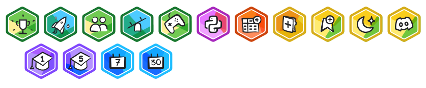
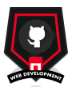
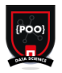

<h1 align="center"><b>Hi , I'm Javi </b></h1>  

  

## About me:

Passionate about transforming data into practical solutions and clear strategies. ✨

With motivation to face complex challenges, such as those presented by Kaggle competitions, where skills are tested and new techniques are acquired. 🚀

Focus on constantly generating value, both in daily and weekly tasks, by identifying key patterns and collaborating on initiatives with tangible impact. 🔍💡

## Kaggle Badges:

## The Bridge DataScience Bootcamp's Badges:

## Repositorios:

## ¿How to contact me?
-correo: javierrodriguezfontiveros@gmail.com
-linkedin
-github
-kaggle
-dockerhub

## Tecnologías Usadas:

!--
**JavierRodriguezFontiveros/JavierRodriguezFontiveros** is a ✨ _special_ ✨ repository because its `README.md` (this file) appears on your GitHub profile.

Here are some ideas to get you started:

- 🔭 I’m currently working on ...
- 🌱 I’m currently learning ...
- 👯 I’m looking to collaborate on ...
- 🤔 I’m looking for help with ...
- 💬 Ask me about ...
- 📫 How to reach me: ...
- 😄 Pronouns: ...
- ⚡ Fun fact: ...
--

(explicar cada uno de los proyectos)
